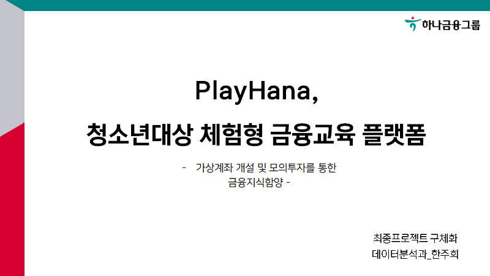
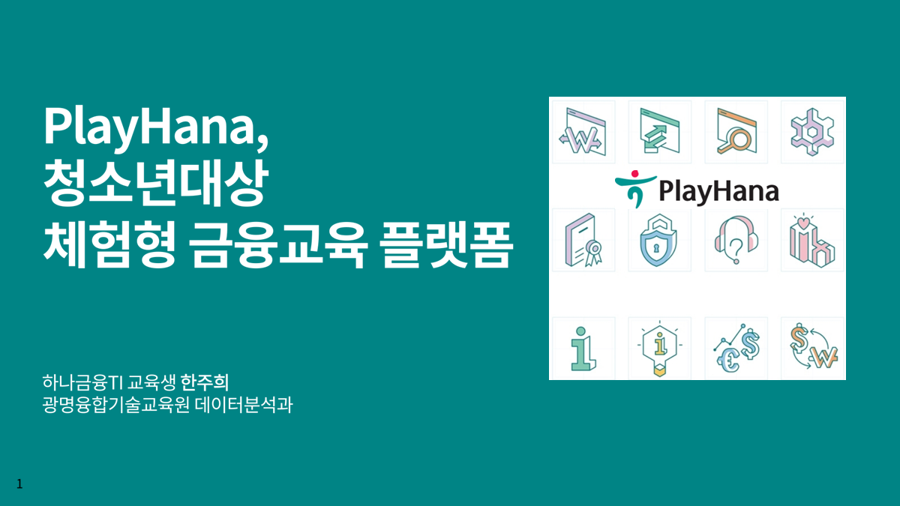
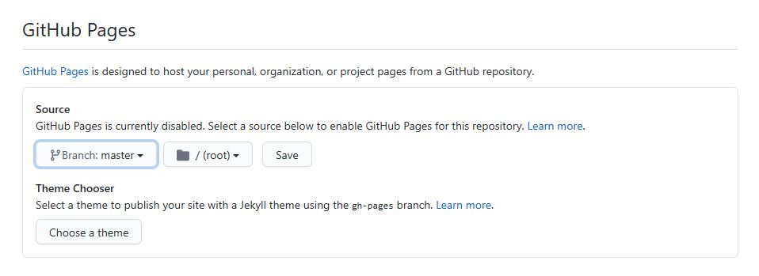

# 프로젝트 제목

[프로젝트 홈페이지 - https://koposoftware.github.io/2021_18_jhhan/](https://koposoftware.github.io/2021_18_jhhan/)

# 1. 프로젝트 개요

경제에 대한 거부감, 주식시장 유입고객연령의 낮아짐, 실용성있는 금융교육의 결핍 등, 금융교육의 필요성이 확대되고 있음에 따라, 청소년들을 대상으로 한 온라인 ‘체험형 금융교육 플랫폼’을 개발하고자 한다. 
또한, 기존 하나은행의 1사1교 프로그램을 확장하여 온라인 교육을 진행하며, 금융교육 서비스를 제공하는 타 기관과 차별화를 둔, 체험형 교육 플랫폼이다.
PlayHana금융거래 체험을 통한 청소년들의 금융지식 함양 및 미래 잠재고객 확보를 목적으로 한다.

# 2. 프로젝트 제안서

   [제안서](/project.pptx) 
 

# 3. 프로젝트 결과
## 수행기간
2021/09/06 ~ 2021/10/05

## 담당업무
프로젝트 기획/설계, 데이터베이스 구축 및 Front-end, Back-end 개발

## 사용기술
- Spring MVC 기반 웹 어플리케이션 개발
- JavaMailSender를 사용하여 금융성과리포트 발송
- Coolsms API를 사용하여 본인인증 서비스
- Spring Scheduler를 활용하여 주식 인기종목 30개 크롤링 자동화(15분 간격)
- Kakao API를 활용한 알림서비스
- Spring Locale을 활용한 다국어지원
- YouTube Data API를 활용하여 '하나TV' 실시간 목록 가져오기

## 시스템 아키텍처
  

## ERD

## 발표 ppt 
   [발표자료](/PLAYHANA,청소년대상 금융교육플랫폼_한주희.pdf) 
 

## 시연 동영상 

   <iframe width="560" height="315" src="https://www.youtube.com/embed/m-ML6sETiHE" title="YouTube video player" frameborder="0" allow="accelerometer; autoplay; clipboard-write; encrypted-media; gyroscope; picture-in-picture" allowfullscreen></iframe>

# 4. 본인 소개

|이름 |한주희||
|연락처 | angki_95@naver.com|
|skill set| Frontend - HTML, CSS, Javascript,Bootstrap,jQuery|
| | Backend - Java, Spring, Oracle|
|자격증| 정보처리기사 필기 (2021) |
|수상| 입선- 고용노동부 주최 창업경진대회 |
|특기사항|  TOEIC |

# 5. 기타

# 홈페이지 설정
 본인 repository에서 "Setting"를 들어가서 GitHub Pages에서 설정 변경.
* Source
 Source에서 원하는 branch와 directory 설정한다. 
 기본값은 master 에 root를 설정 
 Save 버튼 꼭 누른다.
 
 * Theme Chooser
 theme을 변경하여 좀더 이쁜 홈페이지를 만든다.
   
    
   
 
